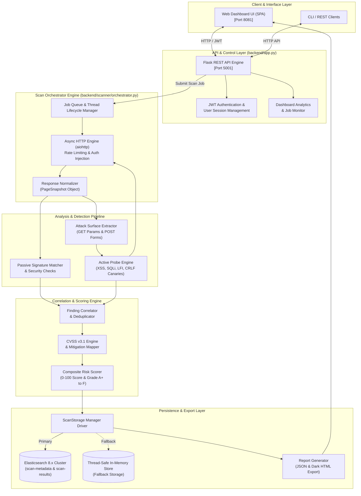
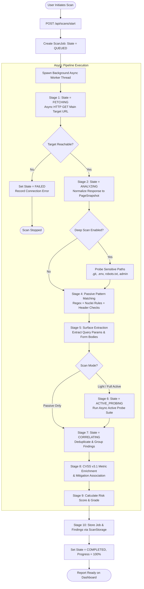
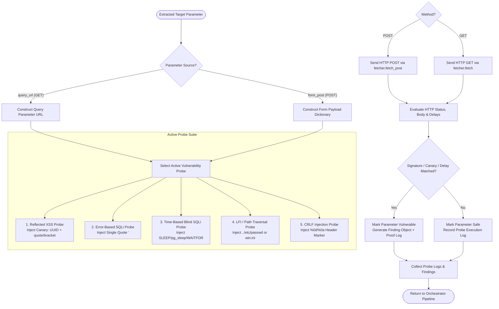

# Mapper — Project Architecture & Scan Pipeline Flowcharts

This document provides visual flowcharts describing the **Mapper Vulnerability Scanner** system architecture, execution pipeline, and decision logic for hackathon presentation slides and project documentation.

---

## 1. High-Level System Architecture Flowchart

---

## 2. Detailed Scan Execution Pipeline Flowchart

---

## 3. Active Probe Injection Decision Flowchart

---

### Key Takeaways for Presentation:
* **Asynchronous Speed**: Utilizes `asyncio` gather loops to parallelize network probes.
* **Dual Injection Capability**: Supports both URL query injection (`GET`) and form payload injection (`POST`).
* **Resilient Architecture**: Fallback mechanism ensures continuous scan operation even when Elasticsearch is unavailable.
