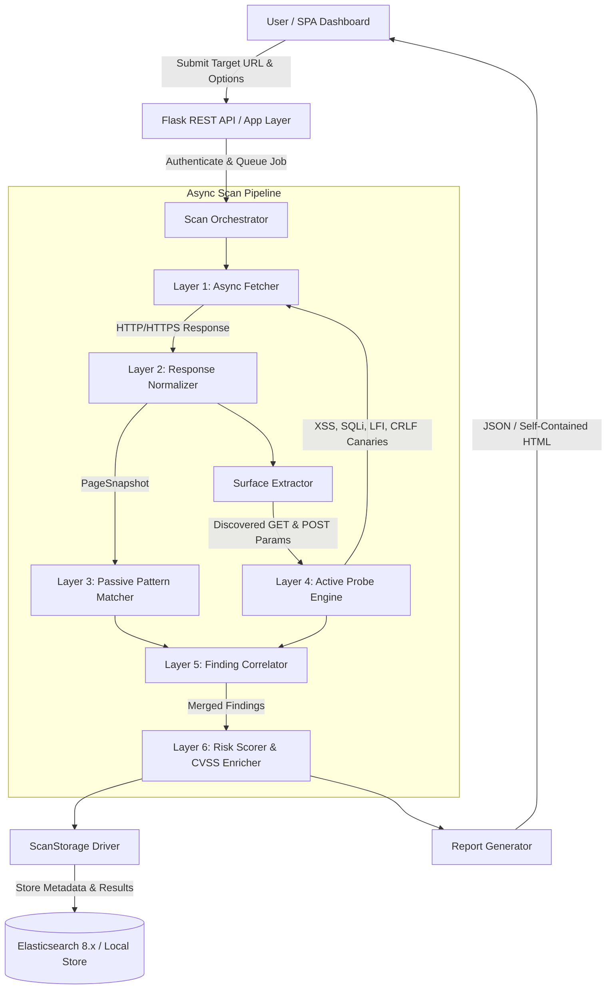

# Mapper — Asynchronous Web Application Vulnerability Scanner
## Hackathon Project Presentation & Technical Blueprint

---

## 1. Problem Statement

Modern web applications are increasingly complex, built with single-page application (SPA) frameworks, multi-tiered REST APIs, dynamic HTML forms, and complex security header/TLS configurations. However, existing vulnerability scanning tools suffer from major drawbacks:

* **High Latency & Resource Overheads**: Heavy, monolithic scanning software (e.g., OWASP ZAP, Burp Suite) relies on synchronous architectures or heavy Java runtimes, making automated large-scale reconnaissance slow and resource-intensive.
* **Unstructured & Unenriched Findings**: Standard scanners generate raw lists of alerts without contextual risk scoring, CVSS v3.1 metrics, or actionable remediation strategies.
* **Limited Active Injection Surfaces**: Many lightweight scanners only inspect URL query parameters, failing to execute active canary injections against POST bodies (HTML forms) or HTTP request headers.
* **Lack of Multi-Source Correlation**: Duplicate findings from custom rules, template engines (Nuclei), and passive signature matchers often clutter scan reports, creating alert fatigue for security researchers.

**Mapper** solves these challenges by providing an asynchronous, micro-modular, and high-performance vulnerability scanner engine that combines passive pattern analysis, active GET/POST canary injection, CVSS enrichment, and real-time dashboard reporting.

---

## 2. Expected Outcome & Proposed Solution

**Mapper** is designed as a full-stack, enterprise-grade web application vulnerability assessment platform.

### Key Capabilities & Architecture Highlights
1. **High-Concurrency Async Scanning Engine**: Built on Python `asyncio` and `aiohttp`, executing concurrent non-blocking HTTP requests with token-bucket rate limiting and TLS inspection.
2. **Multi-Layer Detection Pipeline**:
   * **Passive Signature Engine**: Matches header misconfigurations, missing cookies, regex patterns, and version ranges against safe version databases.
   * **Attack Surface Extractor**: Dynamically discovers injectable parameters from URL query strings, HTML forms (`GET` and `POST`), and same-origin links.
   * **Active Probing Engine**: Non-destructive canary injection targeting XSS, error-based SQLi, time-based blind SQLi, LFI/Path Traversal, and CRLF Header Injection across both GET and POST endpoints.
3. **Correlation & Scoring Module**:
   * **Finding Correlator**: Deduplicates findings across scanning engines based on CVE identifiers, target paths, and evidence locations.
   * **CVSS v3.1 & Threat Intel Enricher**: Queries OSV.dev and NVD databases to attach CVSS base metrics and concrete remediation guides.
   * **Composite Risk Engine**: Calculates a normalized 0–100 risk score and grade (A+ through F) based on vulnerability severity weights.
4. **Persistence & Presentation**:
   * **Elasticsearch Persistence**: Dual storage driver supporting Elasticsearch 8.x time-series indexing (`scan-results-YYYY.MM.DD`) with thread-safe in-memory fallback.
   * **Cyber-Dark SPA Dashboard**: Real-time monitoring UI, rule reloader, and self-contained HTML/JSON report generator.

---

## 3. Workflow Diagram



---

## 4. Technologies & Tools Planned / Used

| Category | Technology / Library | Role & Purpose |
| :--- | :--- | :--- |
| **Language & Core** | Python 3.10+ | Core engine implementation with standard library `asyncio`, `dataclasses`, and `threading`. |
| **HTTP Engine** | `aiohttp`, `ssl` | Asynchronous, non-blocking HTTP network fetcher, SSL/TLS handshake inspection. |
| **Parser & Surface** | `BeautifulSoup4`, `lxml` | Fast HTML body parsing, DOM tree analysis, form and parameter extraction. |
| **API Backend** | `Flask`, `Flask-CORS` | Lightweight REST API serving dashboard endpoints and scan orchestration. |
| **Authentication** | `PyJWT`, `Werkzeug` | JWT token authentication, PBKDF2:SHA256 password hashing, rate limiting lockouts. |
| **Persistence** | `elasticsearch 8.x` | Scalable time-series storage for scan jobs and vulnerability document indexing. |
| **Threat Intel** | `requests`, OSV.dev API | Real-time CVE metadata lookup, CVSS score mapping, and safe version verification. |
| **Frontend UI** | Vanilla JS, CSS3, HTML5 | Modern, high-contrast "Cyber Black" dark-themed single page dashboard. |

---

## 5. Pseudocode & Algorithms

### 5.1 Main Scanning Pipeline Algorithm

```text
ALGORITHM RunScanPipeline(target_url, options):
    Input: target_url (String), options (Dict with scan_mode, rate_limit, auth)
    Output: ScanReport (Dict containing findings, risk_score, active_logs)

    1. Initialize Fetcher with rate_limit and auth credentials
    2. fetch_result = AWAIT Fetcher.fetch(target_url)
    3. IF fetch_result has network_error THEN:
           RETURN MarkJobFailed("Target unreachable")

    4. snapshot = Normalizer.normalize(fetch_result)
    5. findings = []

    6. IF options.deep_scan IS TRUE THEN:
           common_findings = AWAIT CheckCommonPaths(target_url, Fetcher)
           findings.append(common_findings)

    7. passive_findings = Matcher.match_all(snapshot)
    8. findings.append(passive_findings)

    9. surface = ExtractAttackSurface(snapshot, target_url)

    10. IF options.scan_mode IN ["light_active", "full_active"] THEN:
            active_findings, active_logs = AWAIT RunActiveProbes(Fetcher, surface, options.scan_mode)
            findings.append(active_findings)

    11. correlated_findings = Correlator.deduplicate(findings)
    12. enriched_findings = CVSS_Enricher.enrich(correlated_findings)
    13. risk_summary = RiskScorer.calculate(enriched_findings)

    14. ScanStorage.store_job_and_findings(job_id, risk_summary, enriched_findings)
    15. RETURN GenerateReport(risk_summary, enriched_findings, active_logs)
```

### 5.2 Active Canary Injection Engine (GET & POST)

```text
ALGORITHM RunActiveProbes(Fetcher, surface, scan_mode):
    Input: Fetcher instance, surface (AttackSurface), scan_mode (String)
    Output: (findings, probe_logs)

    FOR EACH param IN surface.params UP TO MAX_PROBES:
        is_post = (param.source == "form_post")
        
        # Test 1: Reflected XSS Canary
        canary = GenerateUniqueUUID() + "'\"><"
        probe_url, post_data = PreparePayload(param, canary, is_post)
        
        IF is_post THEN:
            res = AWAIT Fetcher.fetch_post(probe_url, data=post_data)
        ELSE:
            res = AWAIT Fetcher.fetch(probe_url)
            
        IF canary IN res.body THEN:
            CreateXSSFinding(param, method="POST" IF is_post ELSE "GET")

        # Test 2: Error-Based SQL Injection
        sqli_payload = param.value + "'"
        probe_url, post_data = PreparePayload(param, sqli_payload, is_post)
        
        res = AWAIT ExecuteRequest(Fetcher, probe_url, post_data, is_post)
        IF MatchSQLErrorSignatures(res.body) THEN:
            CreateSQLiFinding(param, method="POST" IF is_post ELSE "GET")

    RETURN compiled_findings, compiled_logs
```

---

## 6. Assumptions, Challenges & Mitigations

| Category | Challenge / Issue | Assumption & Proposed Solution |
| :--- | :--- | :--- |
| **Safety & Non-Destructiveness** | Sending injection payloads could break remote applications or corrupt databases. | **Assumption**: All active probes use non-destructive canary strings (e.g. harmless UUID reflection, read-only SQL error triggers, `sleep()` timers). Probing requires explicit user check authorization. |
| **WAF & Rate Limiting** | Target Web Application Firewalls (WAFs) or network rate limits can block scanner IP. | **Solution**: Built-in `AsyncRateLimiter` implementing a token-bucket algorithm, customizable RPS limits, and user-agent rotation. |
| **Dynamic SPA Rendering** | Raw HTTP fetchers cannot execute Client-Side JavaScript rendering (DOM-XSS). | **Scope**: Scanner focuses on backend HTTP/HTTPS surfaces, headers, API endpoints, and server-side forms. Headless browser integration planned for v2. |
| **False Positives** | Generic 200 OK responses on missing files (Soft 404s). | **Solution**: Implemented soft-404 verification heuristics checking body keywords ("not found", "error page") and length thresholds before reporting findings. |

---

### Presentation Summary Checklist (Ready for 21st August 2026)
* [x] **Problem Statement**: Detailed challenges with modern web app security scanning.
* [x] **Proposed Solution**: Complete micro-modular architecture of Mapper.
* [x] **Workflow Diagram**: Mermaid diagram covering end-to-end dataflow.
* [x] **Technologies Used**: Comprehensive technical stack table.
* [x] **Pseudocode**: Algorithms for scanning pipeline and active probing.
* [x] **Assumptions & Challenges**: Risk mitigations, rate limiting, and safe scanning rules.
