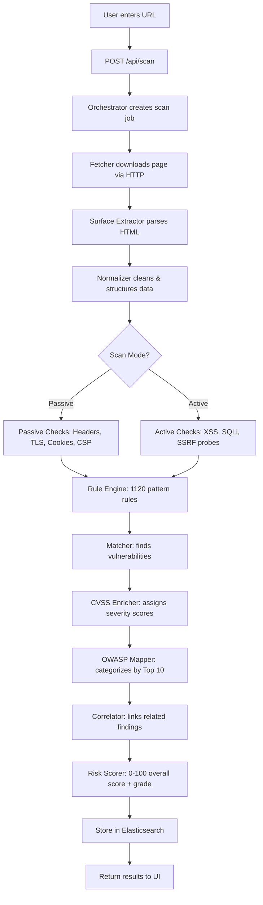

# 🛡️ Sentry — Complete Project Guide

> A comprehensive guide to understand every part of the Sentry vulnerability scanner.

---

## 1. What Is Sentry?

Sentry is a **web application vulnerability scanner** that:
1. Takes a target URL (e.g., `http://scanme.nmap.org`)
2. Fetches the page and inspects HTTP headers, TLS config, HTML content, JavaScript
3. Runs 1,120+ detection rules to find vulnerabilities
4. Scores risk using CVSS and maps to OWASP Top 10
5. Uses **Gemini AI** to generate executive summaries and remediation plans
6. Presents everything in a Chrome extension dashboard or web UI

---

## 2. Architecture Overview

```
┌─────────────────────────────────────────────────────────┐
│                    USER INTERFACES                       │
├──────────────┬──────────────┬──────────────┬────────────┤
│ Chrome       │ Chrome       │ Chrome       │ Web UI     │
│ Popup        │ Dashboard    │ Sidepanel    │ :8081      │
│ (Quick Scan) │ (Full View)  │ (AI Chat)    │ (Fallback) │
└──────┬───────┴──────┬───────┴──────┬───────┴─────┬──────┘
       │              │              │             │
       └──────────────┴──────────────┴─────────────┘
                          │
                    REST API calls
                          │
                          ▼
┌─────────────────────────────────────────────────────────┐
│                   FLASK BACKEND (:5001)                   │
│                                                          │
│  ┌──────────┐  ┌──────────┐  ┌──────────┐  ┌─────────┐│
│  │ Auth     │  │ Scanner  │  │ Analysis │  │ AI      ││
│  │ Module   │  │ Pipeline │  │ Engine   │  │ Proxy   ││
│  └──────────┘  └──────────┘  └──────────┘  └─────────┘│
│                                                          │
│  ┌──────────────────────────┐  ┌───────────────────────┐│
│  │ Elasticsearch Storage    │  │ Gemini API (External) ││
│  └──────────────────────────┘  └───────────────────────┘│
└─────────────────────────────────────────────────────────┘
```

---

## 3. How A Scan Works (Data Flow)



### Step-by-step explanation:

| Step | Component | What It Does |
|------|-----------|-------------|
| 1 | **Fetcher** (`scanner/fetcher.py`) | Makes HTTP request to target URL, captures response headers, body, TLS cert info, redirect chain |
| 2 | **Surface Extractor** (`scanner/surface_extractor.py`) | Parses HTML to find forms, links, scripts, meta tags, cookies — the "attack surface" |
| 3 | **Normalizer** (`scanner/normalizer.py`) | Cleans and standardizes the extracted data into a uniform format |
| 4 | **Passive Checks** (`scanner/passive_checks.py`) | Checks security headers (CSP, HSTS, X-Frame-Options), cookie flags, HTTPS, information leakage — no requests sent |
| 5 | **Active Checks** (`scanner/active_checks.py`) | Sends test payloads for XSS, SQLi, SSRF, open redirect — only in "active" scan mode |
| 6 | **Rule Engine** (`engine/rule_engine.py`) | Matches findings against 1,120 YAML-like rules in `rules/scan_rules.json` |
| 7 | **Matcher** (`scanner/matcher.py`) | Pattern matching engine that identifies vulnerabilities from the rule results |
| 8 | **CVSS Enricher** (`engine/cvss_enricher.py`) | Calculates CVSS v3.1 scores (0-10) for each finding |
| 9 | **OWASP Mapper** (`engine/owasp_mapper.py`) | Maps each finding to OWASP Top 10 2021 and 2025 categories |
| 10 | **Correlator** (`engine/correlator.py`) | Links related findings (e.g., missing CSP + XSS = higher risk) |
| 11 | **Risk Scorer** (`engine/risk_scorer.py`) | Calculates overall risk score (0-100) with letter grade (A-F) |
| 12 | **Orchestrator** (`scanner/orchestrator.py`) | Coordinates the entire pipeline, manages progress, handles errors |

---

## 4. File-by-File Breakdown

### Backend (`backend/`)

| File | Purpose |
|------|---------|
| [app.py](file:///home/halalhacker/mapper/backend/app.py) | **Main Flask app** — All REST API routes, CORS, Gemini AI proxy |
| [config.py](file:///home/halalhacker/mapper/backend/config.py) | Configuration — ports, timeouts, API keys (from env vars), paths |
| [auth.py](file:///home/halalhacker/mapper/backend/auth.py) | JWT authentication — login, logout, token creation/validation |

#### Scanner Pipeline (`backend/scanner/`)
| File | Purpose |
|------|---------|
| [orchestrator.py](file:///home/halalhacker/mapper/backend/scanner/orchestrator.py) | **Brain** — coordinates entire scan pipeline, manages async tasks |
| [fetcher.py](file:///home/halalhacker/mapper/backend/scanner/fetcher.py) | HTTP client — async requests, TLS inspection, rate limiting |
| [surface_extractor.py](file:///home/halalhacker/mapper/backend/scanner/surface_extractor.py) | HTML parser — extracts forms, links, scripts, cookies |
| [normalizer.py](file:///home/halalhacker/mapper/backend/scanner/normalizer.py) | Data cleaning and standardization |
| [passive_checks.py](file:///home/halalhacker/mapper/backend/scanner/passive_checks.py) | Non-intrusive security checks (headers, cookies, TLS) |
| [active_checks.py](file:///home/halalhacker/mapper/backend/scanner/active_checks.py) | Intrusive checks (XSS/SQLi payload testing) |
| [matcher.py](file:///home/halalhacker/mapper/backend/scanner/matcher.py) | Pattern matching against rule database |

#### Analysis Engine (`backend/engine/`)
| File | Purpose |
|------|---------|
| [rule_engine.py](file:///home/halalhacker/mapper/backend/engine/rule_engine.py) | Loads and applies 1,120 detection rules |
| [cvss_enricher.py](file:///home/halalhacker/mapper/backend/engine/cvss_enricher.py) | CVSS v3.1 severity scoring |
| [owasp_mapper.py](file:///home/halalhacker/mapper/backend/engine/owasp_mapper.py) | Maps findings to OWASP Top 10 categories |
| [correlator.py](file:///home/halalhacker/mapper/backend/engine/correlator.py) | Links related vulnerabilities |
| [risk_scorer.py](file:///home/halalhacker/mapper/backend/engine/risk_scorer.py) | Overall risk score (0-100) + letter grade |

#### Other Backend
| File | Purpose |
|------|---------|
| [storage/__init__.py](file:///home/halalhacker/mapper/backend/storage/__init__.py) | Elasticsearch CRUD — stores/retrieves scan data |
| [export/report_exporter.py](file:///home/halalhacker/mapper/backend/export/report_exporter.py) | Generates HTML/JSON export reports |
| [enrichment/cve_enricher.py](file:///home/halalhacker/mapper/backend/enrichment/cve_enricher.py) | Looks up CVE databases for known vulnerabilities |
| [importers/nuclei_importer.py](file:///home/halalhacker/mapper/backend/importers/nuclei_importer.py) | Imports Nuclei vulnerability templates |
| [importers/wappalyzer_importer.py](file:///home/halalhacker/mapper/backend/importers/wappalyzer_importer.py) | Imports Wappalyzer technology fingerprints |

---

### Chrome Extension (`extension/`)

| File | Purpose |
|------|---------|
| [manifest.json](file:///home/halalhacker/mapper/extension/manifest.json) | Chrome MV3 manifest — permissions, CSP, pages |
| [background/service-worker.js](file:///home/halalhacker/mapper/extension/background/service-worker.js) | Background service worker — message routing, tab management |

#### Popup (Quick Scan Interface)
| File | Purpose |
|------|---------|
| [popup/popup.html](file:///home/halalhacker/mapper/extension/popup/popup.html) | Small popup UI when you click the extension icon |
| [popup/popup.js](file:///home/halalhacker/mapper/extension/popup/popup.js) | Popup logic — URL input, scan submission, progress tracking |
| [popup/popup.css](file:///home/halalhacker/mapper/extension/popup/popup.css) | Popup styling |

#### Dashboard (Full Report View)
| File | Purpose |
|------|---------|
| [dashboard/dashboard.html](file:///home/halalhacker/mapper/extension/dashboard/dashboard.html) | Full-page dashboard — scan list, reports, OWASP charts, AI analysis |
| [dashboard/dashboard.js](file:///home/halalhacker/mapper/extension/dashboard/dashboard.js) | **Largest JS file** — all dashboard logic, navigation, rendering |
| [dashboard/dashboard.css](file:///home/halalhacker/mapper/extension/dashboard/dashboard.css) | Dashboard dark-theme styling |

#### Sidepanel (AI Chat)
| File | Purpose |
|------|---------|
| [sidepanel/sidepanel.html](file:///home/halalhacker/mapper/extension/sidepanel/sidepanel.html) | Side panel for AI chat + live scan list |
| [sidepanel/sidepanel.js](file:///home/halalhacker/mapper/extension/sidepanel/sidepanel.js) | AI chat logic, scan list with view/delete |
| [sidepanel/sidepanel.css](file:///home/halalhacker/mapper/extension/sidepanel/sidepanel.css) | Sidepanel styling |

#### AI Module
| File | Purpose |
|------|---------|
| [ai/analyzer.js](file:///home/halalhacker/mapper/extension/ai/analyzer.js) | AI analysis orchestrator — caching, function routing |
| [ai/gemini-client.js](file:///home/halalhacker/mapper/extension/ai/gemini-client.js) | HTTP client for Gemini API (via backend proxy) |
| [ai/prompts.js](file:///home/halalhacker/mapper/extension/ai/prompts.js) | Curated prompt templates for each analysis type |

#### Shared
| File | Purpose |
|------|---------|
| [shared/api-client.js](file:///home/halalhacker/mapper/extension/shared/api-client.js) | Shared HTTP client for backend API calls |
| [shared/theme.css](file:///home/halalhacker/mapper/extension/shared/theme.css) | CSS variables (colors, fonts, spacing) |

---

### Web Frontend (`frontend/`)

| File | Purpose |
|------|---------|
| [index.html](file:///home/halalhacker/mapper/frontend/index.html) | Standalone web UI (alternative to extension) |
| [app.js](file:///home/halalhacker/mapper/frontend/app.js) | All frontend logic (mirrors dashboard.js but for browser) |
| [style.css](file:///home/halalhacker/mapper/frontend/style.css) | Web UI styling |

---

### Data Files

| File | Purpose |
|------|---------|
| [rules/scan_rules.json](file:///home/halalhacker/mapper/rules/scan_rules.json) | **1,120 vulnerability detection rules** — the heart of the scanner |
| [rules/correlation_rules.json](file:///home/halalhacker/mapper/rules/correlation_rules.json) | Rules for linking related findings |
| [data/safe_versions.json](file:///home/halalhacker/mapper/data/safe_versions.json) | Known-safe software versions for version checks |
| `data/nuclei-templates/` | Nuclei project vulnerability templates |

---

## 5. API Reference

| Endpoint | Method | Purpose |
|----------|--------|---------|
| `/api/auth/login` | POST | Login, returns JWT token |
| `/api/auth/logout` | POST | Invalidate session |
| `/api/scan` | POST | Submit a new scan |
| `/api/scan/:id` | GET | Get scan status/details |
| `/api/scan/:id` | DELETE | Delete a scan |
| `/api/scan/:id/report` | GET | Full scan report with findings |
| `/api/scan/:id/export` | GET | Export as JSON or HTML |
| `/api/scans` | GET | List all scans |
| `/api/rules` | GET | List detection rules |
| `/api/ai/analyze` | POST | Send prompt to Gemini AI |
| `/api/ai/stream` | POST | Stream AI response (SSE) |
| `/api/ai/status` | GET | Check AI configuration |
| `/api/stats` | GET | Dashboard statistics |

---

## 6. Key Technologies

| Technology | Used For |
|-----------|----------|
| **Python / Flask** | Backend REST API |
| **aiohttp** | Async HTTP fetching for scans |
| **Elasticsearch** | Persistent scan data storage |
| **Google Gemini AI** | Vulnerability analysis & recommendations |
| **Chrome Manifest V3** | Browser extension (popup, dashboard, sidepanel) |
| **Vanilla JS / CSS** | All frontend UIs (no frameworks) |
| **JWT** | Authentication tokens |
| **CVSS v3.1** | Industry-standard vulnerability scoring |

---

## 7. Presentation Talking Points

### Opening (1 min)
> "Sentry is a web vulnerability scanner that combines traditional security scanning with AI-powered analysis. It can scan any website, identify vulnerabilities, and provide remediation guidance."

### Demo Flow (5 min)
1. Open `http://localhost:8081` → login as admin
2. Show existing completed scan with 238 findings
3. Click into the report — show severity breakdown, OWASP coverage
4. Click "AI Analysis" → show executive summary generation
5. Show export functionality (JSON/HTML report)
6. Quick demo: submit a new scan to `http://scanme.nmap.org`

### Technical Deep-Dive (3 min)
> "The scanner pipeline has 12 stages: fetching → surface extraction → passive/active checks → rule matching → CVSS scoring → OWASP mapping → correlation → risk scoring."

> "We use 1,120 detection rules covering XSS, SQLi, CSRF, misconfiguration, information leakage, and more."

> "AI integration uses Google Gemini to generate executive summaries, prioritize fixes, and explain individual vulnerabilities."

### Q&A Prep
- **"Why not just use OWASP ZAP?"** → Sentry adds AI analysis, Chrome extension integration, and modern UI
- **"How accurate is it?"** → Uses industry-standard CVSS scoring and 1,120 rules from Nuclei templates
- **"Is it safe to use?"** → Passive mode only inspects responses, never sends attack payloads. Active mode requires explicit authorization
